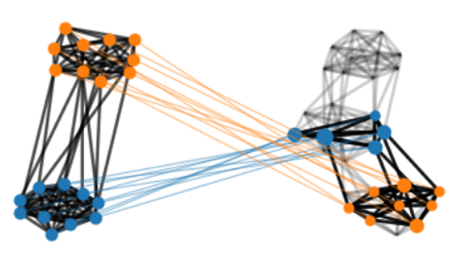
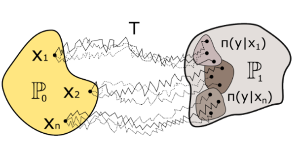
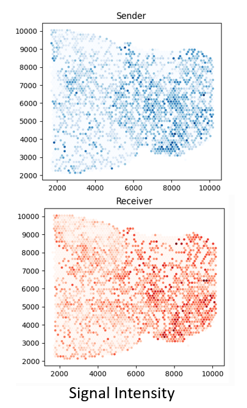
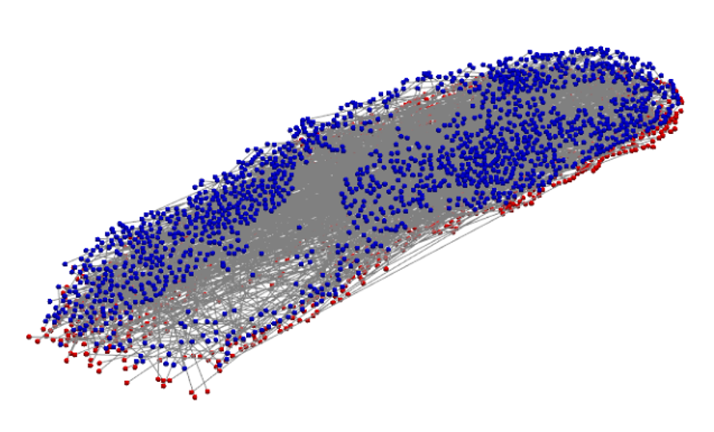
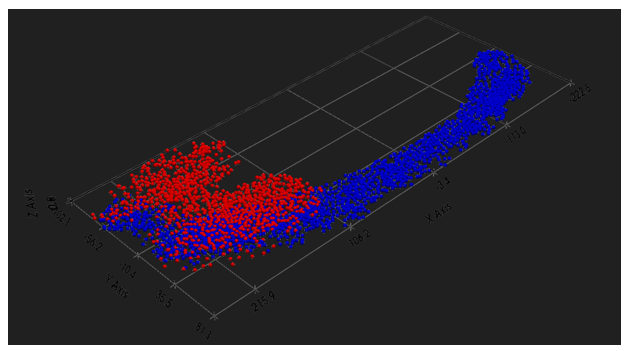
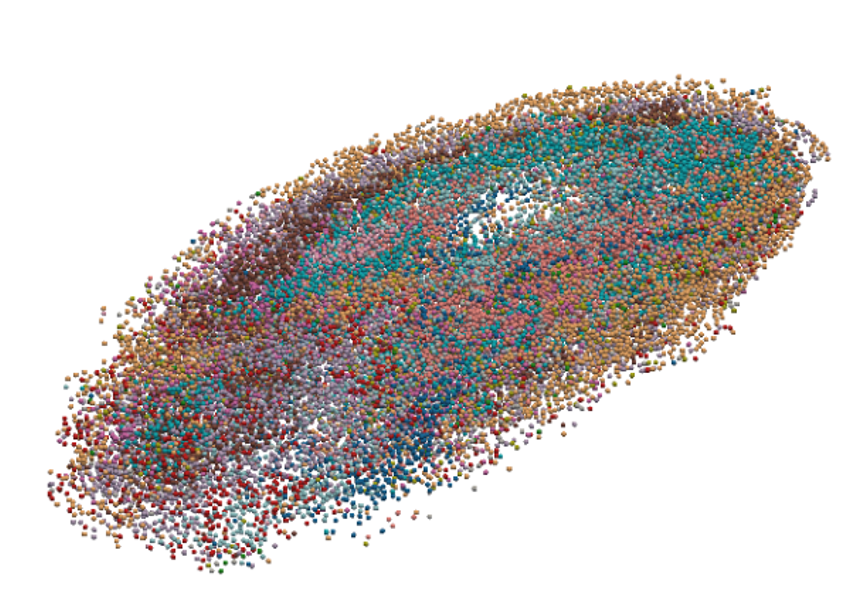
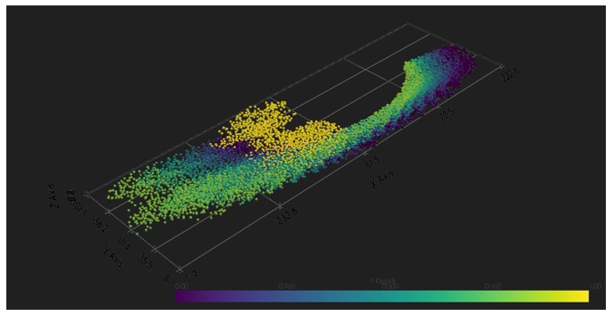

# ST3D

**3D Reconstruction of Spatial Transcriptomic Data Using Optimal Transport**

ST3D reconstructs a continuous 3D transcriptomic atlas from a stack of serial 2D
spatial transcriptomics (ST) sections. Most ST technologies profile gene
expression on thin tissue slices, capturing only 2D snapshots of an inherently
3D volume — discarding z-axis organization that matters for development,
neuroscience, oncology, and especially cell–cell communication (CCC). ST3D
aligns adjacent slices, interpolates the tissue between them, and analyzes
signaling in the recovered 3D volume.

## Pipeline

ST3D runs in four sequential stages:

1. **Graph modeling** — each slice is represented as `(X, C, p)`: PCA-reduced
   expression features `X`, an intra-slice structure matrix `C` of pairwise
   spatial distances, and a probability measure `p` over cells.
2. **Alignment (srFGW)** — adjacent slices are aligned with a Semi-relaxed Fused
   Gromov-Wasserstein coupling that jointly matches expression features and
   tissue structure while tolerating changes in cell density.
3. **Interpolation (Schrödinger Bridge)** — a deep generative model learns the
   velocity field governing how cells move and change expression along the
   z-axis, generating dense intermediate slices.
4. **3D-COMMOT** — cell–cell communication is inferred on the reconstructed
   volume by modeling ligand–receptor signaling as a collective optimal
   transport problem in 3D.

### Alignment with semi-relaxed FGW



*The entropic semi-relaxed Fused Gromov-Wasserstein. Points in one dataset are
mapped to points of the same type in another dataset; unlike standard OT, not
all points need to be mapped.*

Classical OT enforces strict mass conservation, which is routinely violated
between tissue slices due to proliferation, apoptosis, and sectioning artifacts.
srFGW keeps the source marginal fixed while relaxing the target marginal
(penalized by KL divergence), giving a robust, directed coupling suited to
sequential data.

### Interpolation with Schrödinger Bridges



*Schrödinger Bridge: interpolating between two datasets by finding the most
probable stochastic path between them.*

Rather than the linear paths implied by barycentric projection, ST3D models the
transition between slices as the most energy-efficient stochastic process.
Decoupled MLP velocity fields — one for gene expression, one for 3D position —
are integrated with Euler / Euler–Maruyama stepping to produce dynamically
plausible intermediate slices, with the alignment coupling acting as a prior.

### Cell–cell communication with 3D-COMMOT



*COMMOT in 2D: spatial signaling level for the ligand–receptor pair Fgf1–Fgfr1.*

3D-COMMOT extends COMMOT to the reconstructed volume, using 3D Euclidean
distances in the transport cost and a signaling-range cutoff. It yields a
signaling flow matrix and smoothed 3D vector fields that reveal the direction of
communication.

## Results

ST3D was applied to serial sections of the *Drosophila* embryo.



*3D alignment of two Drosophila embryo slices (one blue, one red), with lines
connecting aligned cells.*



*Alignment of two highly heterogeneous Drosophila slices in 3D — the
corresponding portion of the blue slice is matched to the red slice.*



*Reconstructed 3D point cloud of the Drosophila embryo. Each point is a cell,
colored by cell type; three-dimensional tissue structure is recovered across
slices.*



*Cell–cell communication in 3D: 3D-COMMOT signal intensity for ligand–receptor
pairs across two aligned Drosophila embryo slices.*

## Installation

```bash
git clone https://github.com/echang992000/st3d.git
cd st3d/st3d
pip install -e .
```

Requires Python ≥ 3.9. Core dependencies (PyTorch ≥ 2.0, scanpy, anndata,
scikit-learn, numpy, scipy, pandas, plotly, tqdm, pyyaml) are installed
automatically.

## Quick start

```python
import anndata as ad
from st3d import (
    ST3DConfig, ST3DModel, preprocess_sections, Trainer, reconstruct_volume,
)

# 1. Load serial sections (one AnnData each) and their z-depths
sections = [ad.read_h5ad(p) for p in section_paths]
z_coords = [0.0, 1.0, 2.0]  # one depth per section, in z-order

# 2. Preprocess -> normalised (N, 3 + n_pcs) tensors
tensors, norm_params = preprocess_sections(
    sections, z_coords, n_hvgs=2000, n_pcs=50,
)

# 3. Train the drift model
config = ST3DConfig()
model = ST3DModel(config)
trainer = Trainer(model, config)
trainer.fit(tensors, epochs=100)

# 4. Reconstruct a dense 3D volume
volume = reconstruct_volume(model, tensors, norm_params)
# volume.obsm["spatial_3d"] holds 3D coordinates;
# volume.X holds reconstructed gene expression;
# volume.obs["is_observed"] flags measured vs. interpolated cells.
```

See `st3d/notebooks/` for a worked MERFISH example and held-out slice evaluation.

## Repository layout

| Module | Purpose |
| --- | --- |
| `config.py` | `ST3DConfig` dataclass — model, integration, and training hyperparameters |
| `data.py` | Preprocessing, normalization, and AnnData ⇄ tensor conversion |
| `model.py` | `ST3DModel`, KNN-masked local spatial attention, and drift networks |
| `training.py` | `Trainer` with curriculum loss scheduling and device auto-detection |
| `losses.py` | Spatial (Sinkhorn) and expression losses |
| `inference.py` | Euler integration, bidirectional interpolation, `reconstruct_volume` |
| `bridge.py` | Optimal-transport alignment and Schrödinger-bridge utilities |
| `evaluate.py`, `run_eval_plots.py` | Reconstruction metrics and evaluation plots |
| `load_merfish.py` | MERFISH data loading helpers |
| `visualization.py` | 3D point-cloud and signaling visualizations |
| `notebooks/` | Demo and evaluation notebooks |

## Source

The methodology and figures in this README are adapted from Chapter 5 of the
author's University of California, Irvine PhD thesis.
